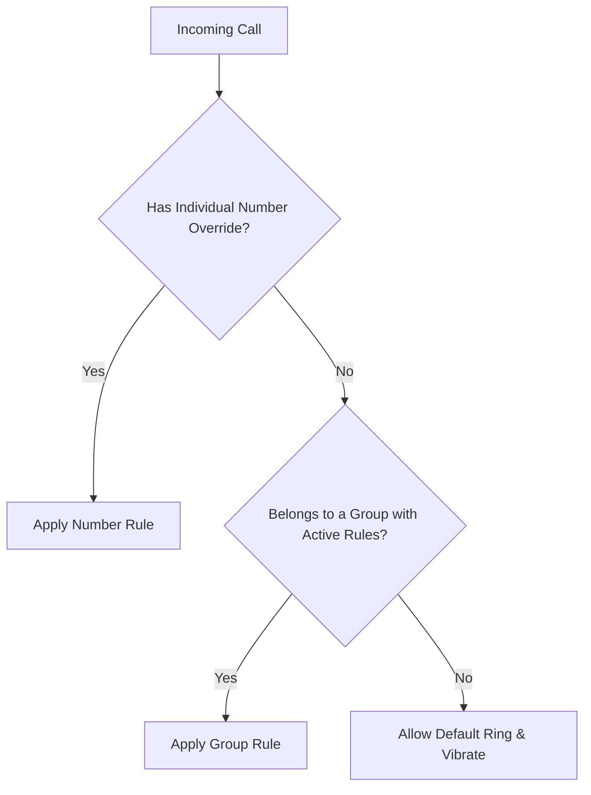

# Mastering Contact Precedence & Overnight 24-Hour Timelines

Scheduling phone ringers can get messy when rules conflict. Silent Mode Control introduces a clean hierarchical decision engine that removes all guesswork.

---

## 1. The Precedence Hierarchy

Whenever an incoming call is received, Silent Mode Control evaluates rules in this exact order:

- **Individual Override:** If you have an explicit schedule set for an individual number (e.g. *Dr. Smith*), it always takes absolute priority over any group rules they might belong to.
- **Group Shared Rules:** If an individual does not have an active custom override, they automatically inherit the schedule of their assigned group (e.g. *Colleagues*).
- **Default Fallback:** Any caller with no matching rules or outside active scheduled windows rings and vibrates normally.

---

## 2. Seamless Overnight Intervals

Traditional timers often fail when a schedule crosses midnight (e.g., from 10:30 PM to 6:30 AM).

In Silent Mode Control, interval crossing is built-in:
- Setting a rule from `22:30` to `06:30` is handled automatically by the evaluation engine.
- You can preview exactly how any caller is handled at 2:00 AM using the built-in **Rule Simulator** screen right inside the app!
